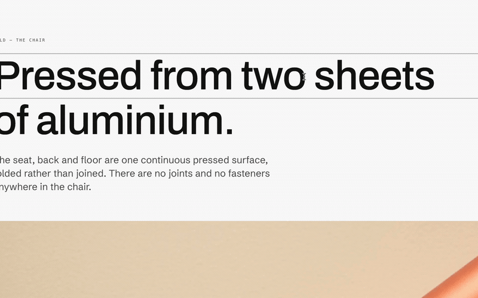
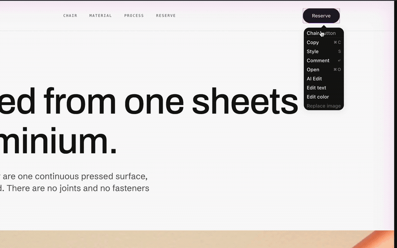
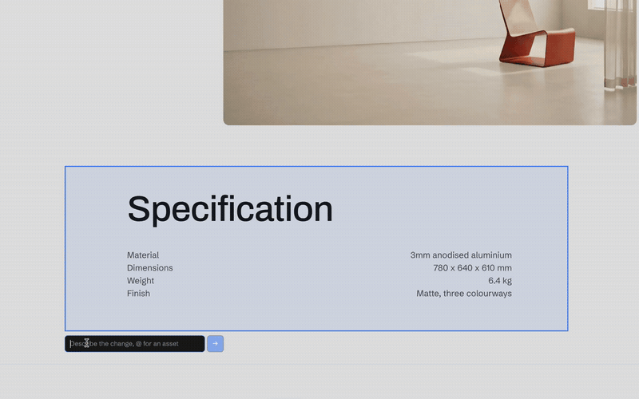
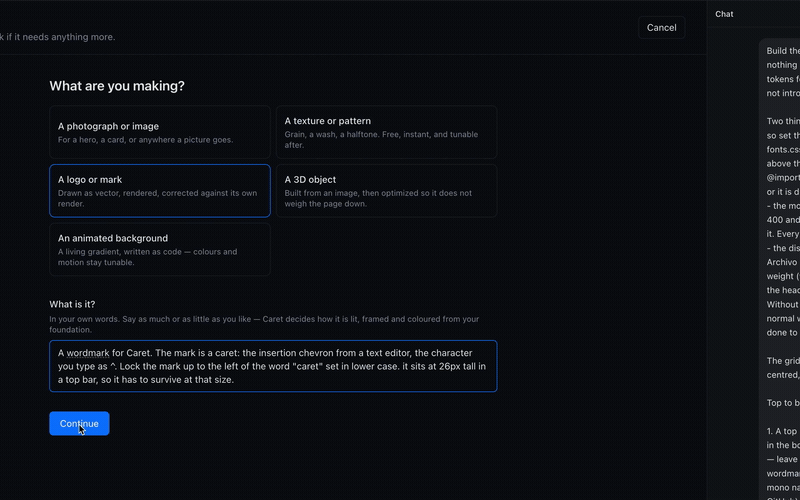
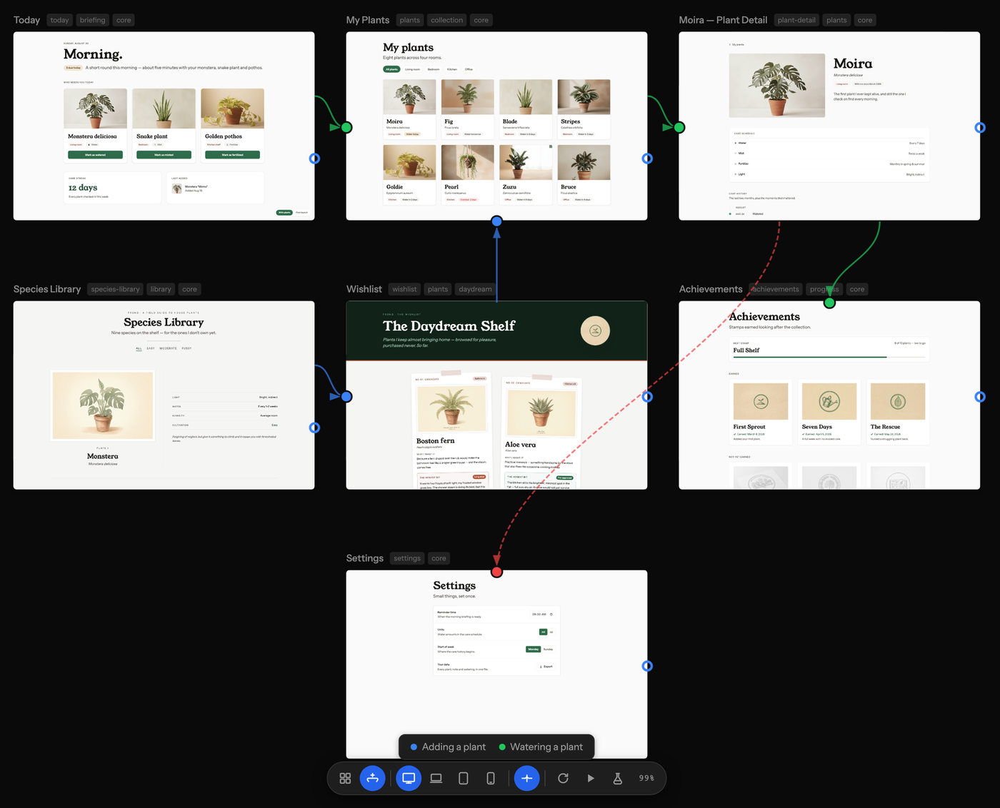

<div align="center">
  <h1>Caret</h1>
  <p><strong>A design layer that lives in your repo.</strong></p>
  <p>
    <a href="https://github.com/precious112/caret-desktop/releases/latest"></a>
    
    
    <a href="LICENSE"></a>
  </p>
  <p>
    <a href="https://github.com/precious112/caret-desktop/releases/latest"><strong>Download</strong></a> ·
    <a href="docs/connect-an-agent.md">Connect your agent</a> ·
    <a href="https://caretai.cloud">Website</a> ·
    <a href="https://github.com/precious112/caret-desktop/discussions">Discussions</a>
  </p>
</div>

https://github.com/user-attachments/assets/93e273d4-aed3-45cd-bb5e-c5b587691017

Your pages render on a canvas. Click a headline and retype it, right-click a
colour and pick a new one, and the change is written into the file behind it.
The canvas was never a picture of your design. It is the design, running.

That design lives in your repo as real React, in `.caret/`, in git, reviewable
in a pull request. Your app's own source stays untouched until you sync. So a
fix you make once is still there tomorrow, instead of being regenerated away
the next time you ask for something.

- **Edit on the page**: text, colour, images, and size, written to the file
- **Ask for the harder changes**: paint a region, describe it in words
- **Three versions at once**: generate, compare, keep one
- **Make the assets too**: logos, photographs, textures, animated backgrounds
- **Sync into your app**: in any framework, both directions
- **Bring your own model**: a subscription you have, or an API key
- **Or hand the sync to your own agent**: Claude Code and Codex work over MCP

Free, runs on your machine, no account. Needs [Node.js](https://nodejs.org/en/download)
installed for the live canvas. This repo holds the source, the issues and the
[downloads](https://github.com/precious112/caret-desktop/releases/latest). It
used to be split in two from when Caret was a VS Code fork; the source moved
in here, and [precious112/caret](https://github.com/precious112/caret) remains
as the old home.

---

## Download

| Platform | Download |
|----------|----------|
| **macOS**, Apple Silicon (M1/M2/M3…) | [Caret-macOS-arm64.zip](https://github.com/precious112/caret-desktop/releases/latest/download/Caret-macOS-arm64.zip) |
| **macOS**, Intel | [Caret-macOS-x64.zip](https://github.com/precious112/caret-desktop/releases/latest/download/Caret-macOS-x64.zip) |
| **Windows**, installer | [Caret-Windows-Setup-x64.exe](https://github.com/precious112/caret-desktop/releases/latest/download/Caret-Windows-Setup-x64.exe) |
| **Windows**, Arm installer | [Caret-Windows-Setup-arm64.exe](https://github.com/precious112/caret-desktop/releases/latest/download/Caret-Windows-Setup-arm64.exe) |
| **Windows**, portable | [Caret-Windows-Portable-x64.exe](https://github.com/precious112/caret-desktop/releases/latest/download/Caret-Windows-Portable-x64.exe) |
| **Linux**, Debian/Ubuntu | [Caret-Linux-amd64.deb](https://github.com/precious112/caret-desktop/releases/latest/download/Caret-Linux-amd64.deb) |
| **Linux**, Fedora/RHEL | [Caret-Linux-x86_64.rpm](https://github.com/precious112/caret-desktop/releases/latest/download/Caret-Linux-x86_64.rpm) |
| **Linux**, AppImage | [Caret-Linux-x86_64.AppImage](https://github.com/precious112/caret-desktop/releases/latest/download/Caret-Linux-x86_64.AppImage) |

macOS builds are signed and notarized by Apple: download, unzip, drag
`Caret.app` into **Applications**, double-click. No warnings.

### Windows: what you will see, and what to click

Windows builds are not code-signed yet, so Windows treats the installer as
unknown. That can produce up to three separate warnings. The app is safe, and
**you never need to turn off your antivirus**. Every warning has a button that
lets you keep going:

1. **When the download finishes**, the browser may say the file "isn't
   commonly downloaded".
   - Chrome: click the download, then **⋯ → Keep → Keep anyway**
   - Edge: **… → Keep → Show more → Keep anyway**
2. **When you run the installer**, SmartScreen says "Windows protected your
   PC". Click **More info → Run anyway**.
3. **If the file never shows up in Downloads at all**, Defender quarantined it
   on arrival. Open **Windows Security → Virus & threat protection →
   Protection history**, find the Caret entry, choose **Restore**, then run
   the installer and do step 2.

**If Defender keeps removing the file anyway**, turn real-time protection off
just for the install:

1. **Windows Security → Virus & threat protection → Manage settings**, switch
   **Real-time protection** off.
2. Download and run the installer.
3. Switch it back on. Windows also re-enables it by itself after a short
   while, so you cannot forget it off.

Prefer the terminal? This does the same as step 2 of the warnings above:

```powershell
Unblock-File "$HOME\Downloads\Caret-Windows-Setup-x64.exe"
```

### Linux

No signing needed: `sudo dpkg -i` the `.deb`, `sudo rpm -i` the `.rpm`, or
`chmod +x` the AppImage and run it.

### You also need Node.js

Caret's live canvas runs a local dev server, so **Node.js must be installed or
the canvas will not load**. Everything else works without it, which makes this
easy to miss: the app opens, the chat answers, and only the canvas sits on
"preview loading" forever.

Install the **LTS build** from [nodejs.org](https://nodejs.org/en/download) and
you are fine. If you want the exact floor, it is **Node 20.19+, or 22.12+ on
the 22 line**, which is Vite's requirement rather than ours.

Check what you have:

```bash
node --version
```

---

## Edit on the page

Right-click any text, colour or image and change it there. Caret writes it into
the page's own file in `.caret/` and the page reloads.

<p align="center">
  
</p>

Pick a colour and Caret checks it against your design tokens. If one is close,
it writes the token instead of a hex code, so changing your brand colour later
changes everywhere that used it. You can drag an edge to resize, too, and the
size lands in the code.

<p align="center">
  
</p>

## Ask for the harder changes

Some things are too fiddly to click. Paint over the part of the page you mean
and say what you want. Your agent gets the exact elements you marked, so it
does not have to guess which bit you meant.

<p align="center">
  
</p>

## Three versions at once

When you do not know what you want yet, ask for a few. Caret builds them side by
side, live, and you keep one. Picking leaves an undo step.

<p align="center">
  
</p>

## Make the assets too

Say what the thing is and Caret makes it: photographs, textures, logos drawn as
real vector files, and animated backgrounds written as code so the colours stay
adjustable. How it is lit, framed and coloured comes from your design tokens, so
it matches the rest of your work.

<p align="center">
  
</p>

## See the journeys

Describe the paths through your product and the canvas draws them over your
pages. Each journey gets a colour, error paths are dashed, and pages nothing
leads to are obvious.

<p align="center">
  
</p>

## Sync into your app

Your design lives in `.caret/`. Your app is whatever you ship, in any framework.
Caret works out which design files changed since the last sync and your agent
makes the app match. It takes a snapshot first, so undo always works.

It goes the other way too. If someone edits the app directly, Caret notices by
comparing file contents and offers to bring the design back in line. You see
both versions and choose. It never merges them for you.

## Catch the mistakes early

Caret runs a set of plain rules over your pages and shows what it finds on the
canvas without being asked: a colour that is nearly but not quite your brand
colour, text too faint to read, a heading scale that skips a step.

It also writes your tokens into `AGENTS.md`, `CLAUDE.md` and `.cursor/rules`,
and keeps them current. An agent told to "build me a card" that has to *decide*
to look up your spacing scale will not bother, and will invent something
instead.

## Bring your own model

OpenCode's engine is built in and connects to whichever provider you want: an
API key, or a subscription you already have. ChatGPT Plus, Pro and Go, Kimi For
Coding, the Z.AI and Zhipu coding plans, and GitHub Copilot all work as
providers you sign into. Anthropic is API key only, because Anthropic does not
allow Claude subscriptions in other tools.

Already working with an agent in your terminal? Caret exposes your design layer
over MCP, so you can hand it the sync rather than running that here. Designing
itself stays in Caret: MCP runs one way, so an external agent can call in but
Caret cannot push work back out to it. Claude Code and Codex are tested.
See [docs/connect-an-agent.md](docs/connect-an-agent.md).

---

## Your first project

1. **Open a folder.** Caret creates `.caret/` inside it and touches nothing else.
2. **Say what you are building**, in a sentence.
3. **Set your foundation**: colour, type, spacing, radius. Caret can interview
   you, which needs a model, or you can set them by hand, which needs nothing.
4. **Make pages.** Ask in the chat, or write the file yourself. Either way it
   appears on the canvas.

## Building from source

Node 20 or newer.

```bash
npm install
npm run dev       # run in development
npm run build
npm run package   # installer for your platform
```

Tests: `npm run test:unit`, `npm run verify:design-shell`, `npm run verify:app`.

## Licence

Apache-2.0. Free forever, runs on your machine, no key and no account. The only
thing Caret sends anywhere is anonymous usage and crash data, and one click
turns it off. [docs/telemetry.md](docs/telemetry.md) lists exactly what is and
is not collected.
